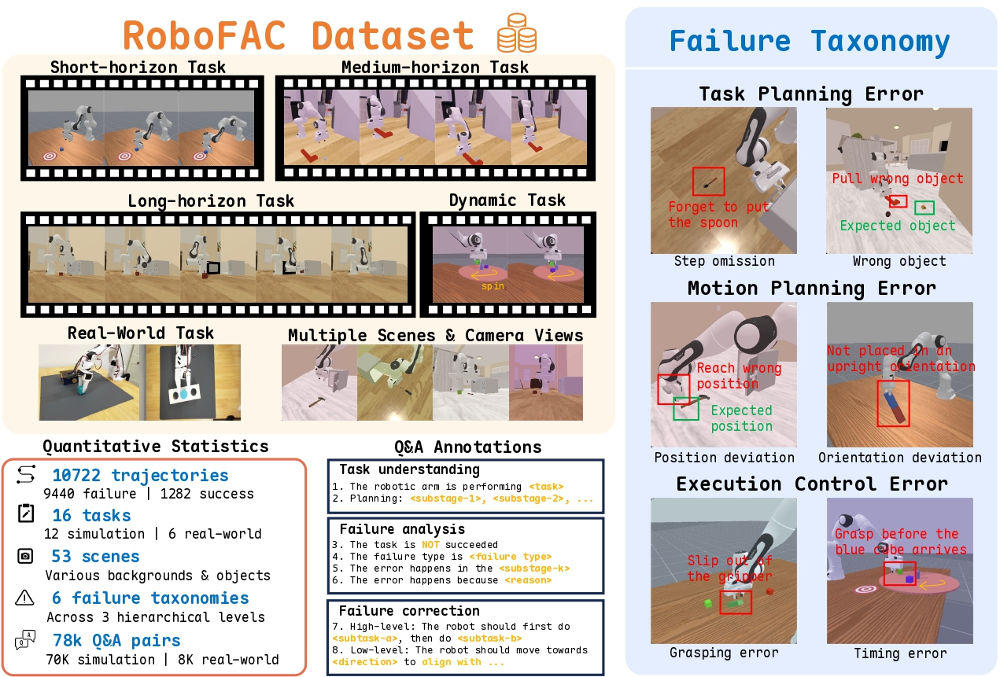
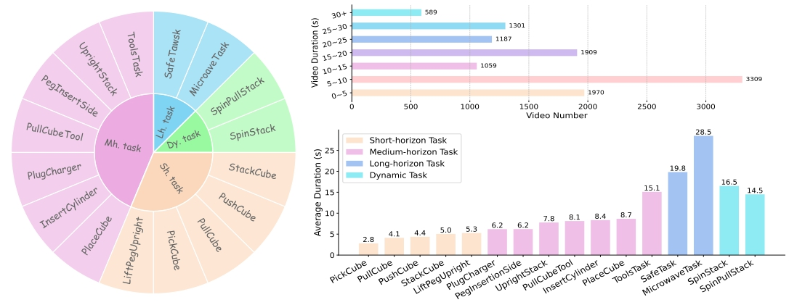
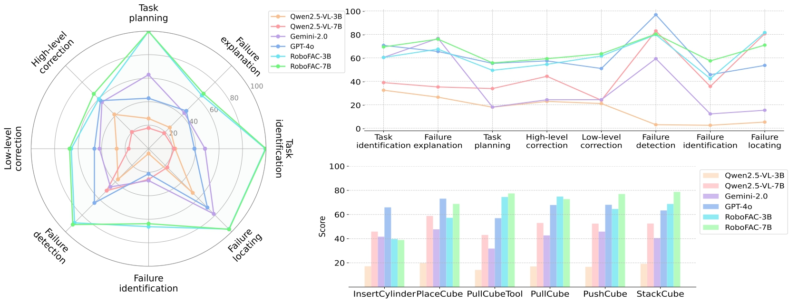

# RoboFAC: A Comprehensive Framework for Robotic Failure Analysis and Correction

[](https://mint-sjtu.github.io/RoboFAC.io/)
[](https://github.com/MINT-SJTU/RoboFAC)
[](https://arxiv.org/abs/2505.12224)
[](https://huggingface.co/datasets/MINT-SJTU/RoboFAC-dataset)
[](https://huggingface.co/MINT-SJTU/RoboFAC-7B)

This is the official repo for our RoboFAC paper: "RoboFAC: A Comprehensive Framework for Robotic Failure Analysis and Correction".

## 🚀 Introduction



**RoboFAC** is a comprehensive framework for **robotic failure analysis and correction** 🛠️🤖.

✨ Key Features:

* 📚 **Large-scale QA Dataset**: Covers diverse robotic tasks, environments, and viewpoints. Includes **eight types** of QA targeting various aspects of failure understanding and correction.
* 🧠 **Failure Understanding Models**: Capable of comprehensive **task understanding**, **failure diagnosis**, and **correction planning** from video-based robotic executions.
* 📊 **Benchmark Suite**: Provides a rigorous benchmark to evaluate robotic failure correction models across multiple tasks and QA dimensions.
* 🤖 **Real-world Deployment**: Integrated into a real robotic control pipeline as an **external critic**, enabling **online error detection and correction** for VLA-based systems.

## 📃 Contents

- [Dataset](#dataset)
- [Model](#models)
- [Benchmark](#benchmark)
- [Data Generation (Optional)](#data-generation)

## 📚 Dataset

RoboFAC Dataset is a large-scale, high-diversity dataset featuring videos of robot manipulation failures, annotated with QA pairs for comprehensive failure reasoning.

👉 Download from HuggingFace: [The RoboFAC Dataset](https://huggingface.co/datasets/MINT-SJTU/RoboFAC-dataset)

## 🧠 Model  

We release RoboFAC-7B, a large vision-language model finetuned for robotic failure analysis and correction.

👉 Get the model from HuggingFace: [The RoboFAC-7B](https://huggingface.co/MINT-SJTU/RoboFAC-7B)

## 📊 Evaluation
To evaluate your model's capacity of task understanding, failure analysis and failure correction, simply run the `evaluation/eval.py`.

To speed up the evaluation process, we use the vLLM engine for model inference. Specifically, you need to first run the following command to launch the model:
```bash
python -m vllm.entrypoints.openai.api_server --model YOUR_MODEL_PATH
```
The final results will be in `results_merged.json`, it contains the model's performance scores on each dimension for each robotic task.

## 🛠️ Data Generation (Optional)
We recommend using the provided RoboFAC dataset directly. However, if you want to replicate or extend the data collection process, follow these steps:
### 1. Environment Setup

#### 1.1. Create a Virtual Environment

```bash
# Clone the RoboFAC repository
git clone https://github.com/MINT-SJTU/RoboFAC.git
cd RoboFAC

# Create and activate a conda environment
conda create -n robofac python=3.10 -y
conda activate robofac
```

#### 1.2. Install ManiSkill

Please follow the official [ManiSkill installation guide](https://github.com/haosulab/ManiSkill?tab=readme-ov-file#installation) to set up the simulation environment properly.

#### 1.3. Download Required Scene Assets

We use two simulator environments, `ReplicaCAD` and `AI2THOR`, which are officially supported by ManiSkill. You can download them using the following commands:

```bash
python -m mani_skill.utils.download_asset ReplicaCAD
python -m mani_skill.utils.download_asset AI2THOR
```

#### 1.4. Apply RoboFAC Configuration

After setting up the environment and downloading the assets, run the following script to configure necessary file replacements:

```bash
cd RoboFAC
python setup_config.py
```

### 2. Collect Successful Trajactories
(Optional) To collect successful demonstration trajectories for reference:
```
cd RoboFAC/data_collection
python collect_success.py
```
⚠️ Note: These scripts are provided for reproducibility only and are not required for using the dataset or models.

## 📫 Acknowledgement

We thank the following projects that parts of our code are derived from:

- [Maniskill](https://github.com/haosulab/ManiSkill)

## 🔗 Citation

```bibtex
@misc{lu2025robofaccomprehensiveframeworkrobotic,
      title={RoboFAC: A Comprehensive Framework for Robotic Failure Analysis and Correction}, 
      author={Weifeng Lu and Minghao Ye and Zewei Ye and Ruihan Tao and Shuo Yang and Bo Zhao},
      year={2025},
      eprint={2505.12224},
      archivePrefix={arXiv},
      primaryClass={cs.RO},
      url={https://arxiv.org/abs/2505.12224}, 
}
```
